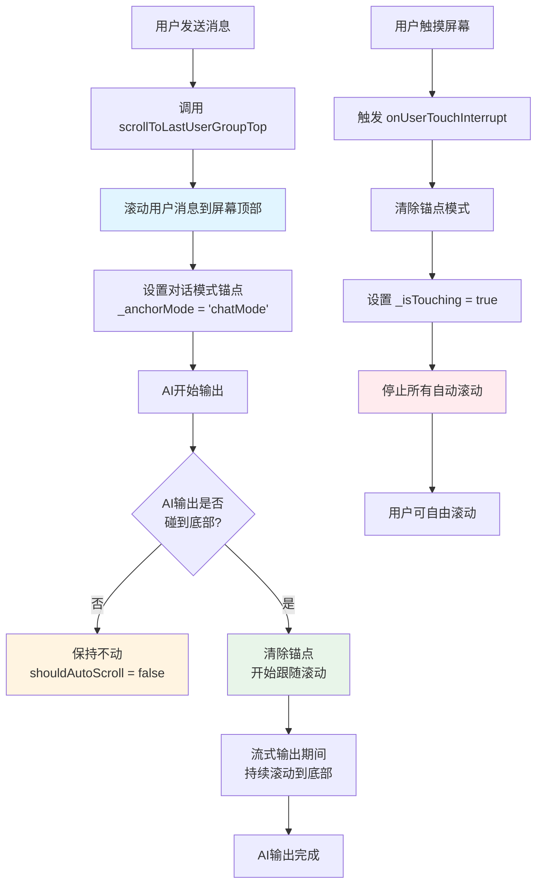
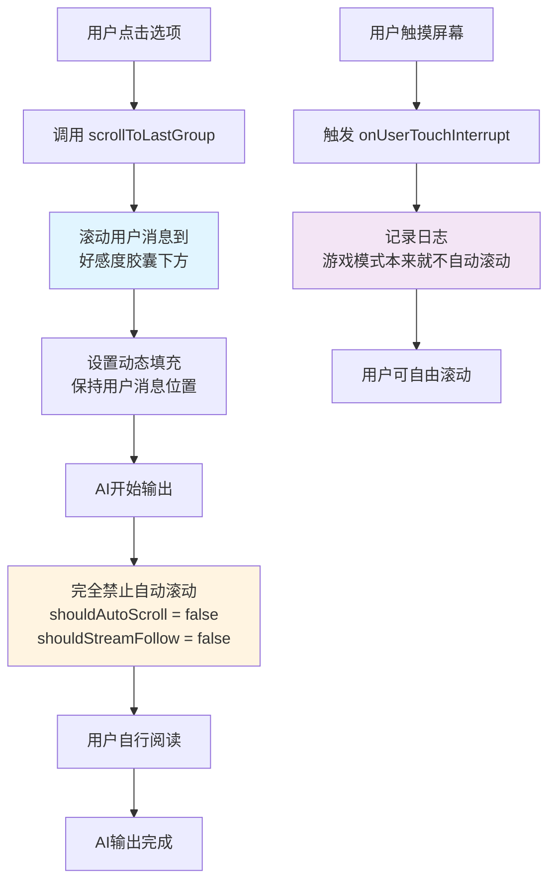
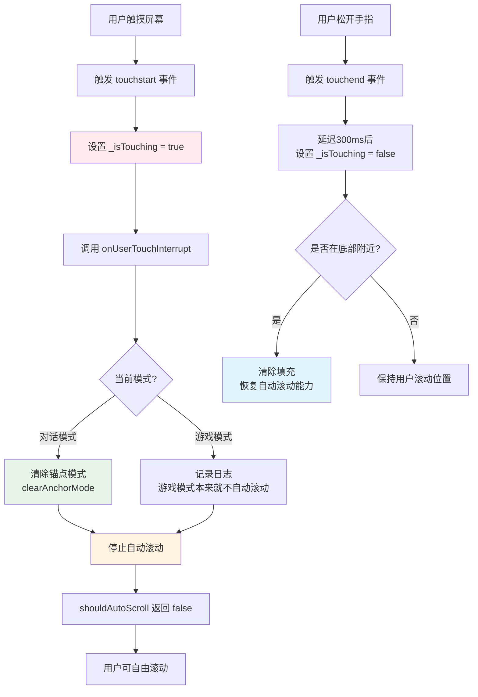
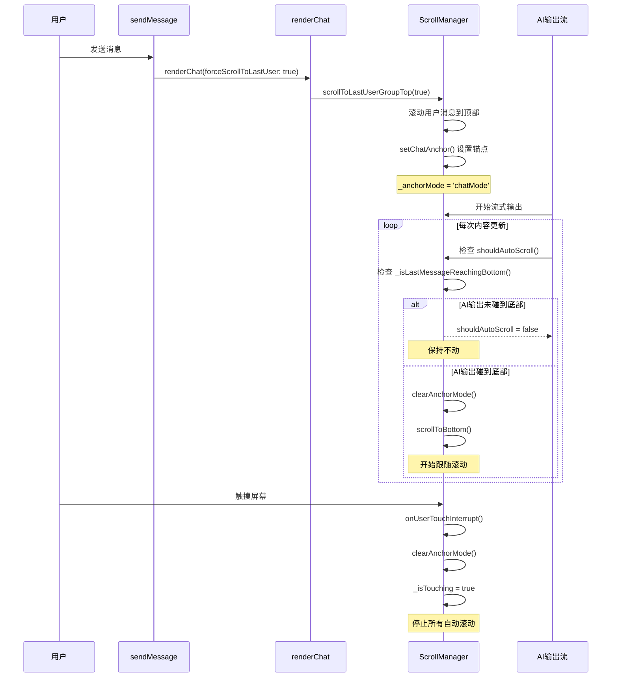
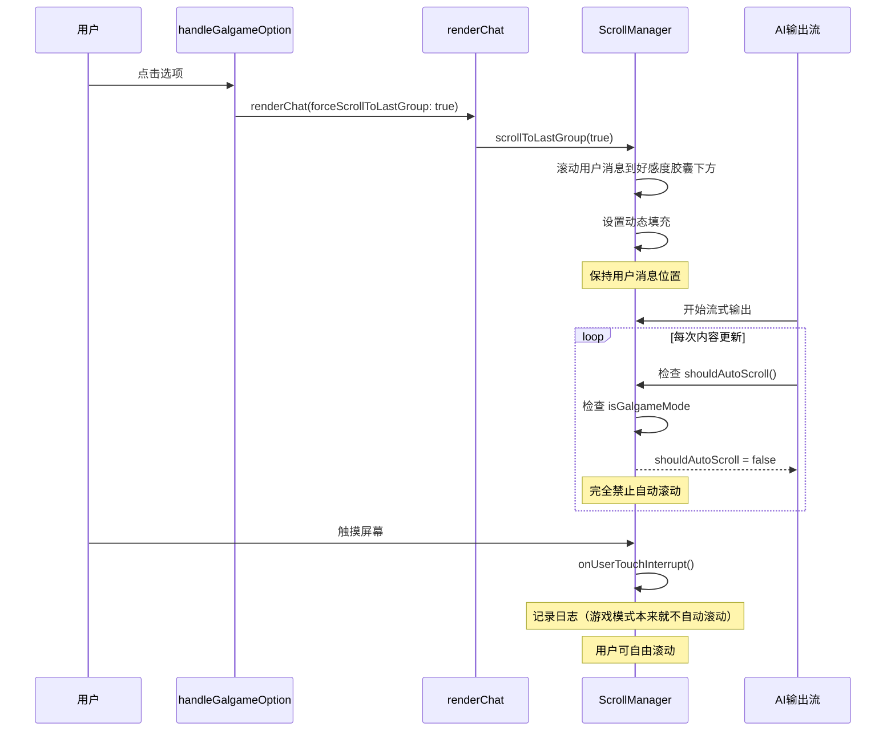

# 滚动行为流程图

## 对话模式滚动流程

## 游戏模式滚动流程

## 触摸打断机制

## 完整交互流程（对话模式）

## 完整交互流程（游戏模式）

## 关键实现验证

### ✅ 对话模式：发送消息 → 用户消息到屏幕顶部
- **实现位置**: `js/chat/chat-api.js:424` → `js/chat/message-ui.js:1341` → `js/core/scroll-manager.js:1258`
- **验证**: `scrollToLastUserGroupTop()` 方法正确实现，计算偏移量并滚动到顶部

### ✅ AI 输出在屏幕内时保持不动
- **实现位置**: `js/core/scroll-manager.js:889-895`
- **验证**: `shouldAutoScroll()` 检查锚点模式，如果 `_isLastMessageReachingBottom()` 返回 false，则返回 false

### ✅ AI 输出碰到底部时开始跟随
- **实现位置**: `js/core/scroll-manager.js:890-895`
- **验证**: 当 `_isLastMessageReachingBottom()` 返回 true 时，清除锚点并允许滚动

### ✅ 游戏模式：点击选项 → 用户消息到好感度胶囊下方
- **实现位置**: `js/chat/chat-api.js:423` → `js/chat/message-ui.js:1338` → `js/core/scroll-manager.js:1058`
- **验证**: `scrollToLastGroup()` 方法正确计算偏移量（包含好感度胶囊高度）

### ✅ 触摸打断：任何时候触摸屏幕都会停止自动滚动
- **实现位置**: `js/core/scroll-manager.js:821-851`
- **验证**: `touchstart` 事件触发 `onUserTouchInterrupt()`，设置 `_isTouching = true`，`shouldAutoScroll()` 检查此标志并返回 false

## 代码关键点

1. **锚点机制** (`scroll-manager.js:58-73`): 对话模式使用锚点控制滚动时机
2. **触摸检测** (`scroll-manager.js:820-851`): 监听 touchstart/touchend/wheel 事件
3. **模式判断** (`scroll-manager.js:860-899`): `shouldAutoScroll()` 根据模式返回不同结果
4. **动态填充** (`scroll-manager.js:1146-1234`): 游戏模式使用动态填充保持用户消息位置
