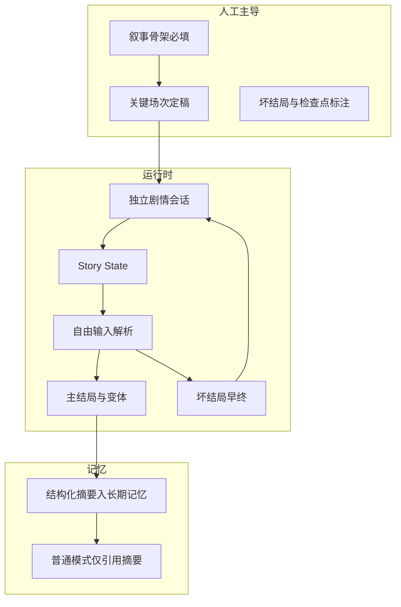

# 剧情模式设计：文字虚拟冒险与互动小说体验

> 文档状态：2026-08-09 已复核。本文作为设计或测试规范继续保留；条目是否已实现以 `docs/PROJECT_STATUS.md` 和代码为准。

> **文档性质**：产品/技术设计草案（待评审与排期）  
> **关联**：`docs/design/安卓两种主要模式设计.md`（模式总览）、`docs/design/普通模式对话设计.md`（`mode=normal` 私聊；本模式与之并列、互不替代）、`docs/design/网页设计.md`（公开站点不提供剧情入口）  
> **最后更新**：2026-06-18（移除具体剧本文案，仅保留通用设计）

---

## 1. 背景与目标

### 1.1 要解决什么问题

用户在 **普通对话模式** 中获得的是「与角色长期相处的日常关系」：话题开放、节奏拟人、记忆偏生活化。  
**剧情模式** 则提供**可区分的第二条产品线**：用户与同一角色进入一段 **有边界、有规则、有结局的文字冒险**，体验接近 **互动小说 / CYOA（Choose Your Own Adventure）**，而非换皮聊天。

剧情模式的一大魅力，恰恰是 **不必锁在角色本篇宇宙里**：可以是 **跨时代、跨世界、架空历史或与真实历史切片碰撞**，让角色用「自身熟悉的思维方式」去遭遇陌生情境。这样与普通模式「日常闲聊」的区分度更强，也更容易做出**不可在别处复刻**的体验。

### 1.2 成功标准（产品侧）

| 维度 | 普通模式 | 剧情模式 |
|------|----------|----------|
| 用户心智 | 「我在和 TA 聊天」 | 「我们在经历一场故事」 |
| 时间线 | 开放、可跳跃话题 | **场次/章节** 推进，有起点与终点 |
| 输入含义 | 发言、表情、日常 | **行动**（调查、对话、使用物品、冒险抉择） |
| 记忆落点 | 关系、习惯、长期偏好 | **剧情摘要、结局、关键抉择**（可回流到长期记忆，见第 6 节） |
| UI 气质 | IM 气泡流 | **阅读区 + 行动区**（可全屏沉浸，弱化「发消息」文案） |

### 1.3 与当前 Galgame / 锁分产品线的关系

当前代码库仍保留并运行「游戏模式 / 锁分模式（Galgame）」：后端实现位于 `Backend/galgame/`，分步提示词在 `Backend/galgame/seq_prompts/`，客户端 Android 侧仍有对应 UI 与接口调用。  
本剧情模式设计是 **未来独立产品线草案**，不直接替代现有 Galgame / 锁分，也不默认复用其好感度分步与复杂 JSON 工程链。剧情模式的核心爽点在 **叙事结构、分支与后果**，技术实现可走「单次叙述 + 结构化状态补丁 + 选项」的简化路径，先保证可读性与节奏。

---

## 2. 核心概念

### 2.1 一场「剧情」的组成

建议将最小可售单元称为 **剧本实例（Playthrough）**，由下列要素构成：

| 要素 | 说明 |
|------|------|
| **剧本模板（Arc Template）** | 元数据：标题、题材标签、预估轮数/时长、难度、适龄与内容分级。可由运营配置或将来由模型辅助生成初稿，再人工审核。 |
| **场次（Beat / Scene）** | 叙事上的一个「屏」：环境描写 + 事件 + 当前可执行行动。对应一次或多次模型调用，产品上可合并为一次「翻页」。 |
| **世界状态（Story State）** | 结构化快照：地点、阶段目标、持有线索/物品、简易数值（任选其一即可，避免过重）：如「专注度」「羁绊值」「危机等级」等，与剧本主题对齐。 |
| **抉择点（Choice）** | 2～4 个显式选项，或「自由输入」但在后端解析为 **行动类型**（见 2.2）。 |
| **检查点（Checkpoint）** | 允许从章节中点重开，降低挫败感。 |
| **结局（Ending）** | 至少一种主结局 + 可选隐藏结局；结算屏展示并触发记忆写入。 |

### 2.2 选项与自由输入

- **显式选项**：模型或模板生成固定列表，用户点选；适合移动端与弱输入场景。  
- **自由输入**：用户打字，由轻量解析或主模型归纳成 `action_type` + `action_detail`，再进入同一套状态机。  
- **设计原则**：同一抉择点上，不同选项应导致 **可见的叙事分歧**（不仅是措辞差异）。

### 2.3 节奏与篇幅

- 单场剧本建议目标：**15～45 分钟** 可完成一条线（可配置）。  
- 每一「屏」正文建议控制在 **可读 30～90 秒**，避免与普通模式的长聊混同。  
- 可配置「自动滚动 / 翻页动效」强化阅读感，与普通 IM **明确区隔**。

### 2.4 世界边界：不局限于「角色原作世界」

**原则**：剧情模式的 **舞台（Where / When）** 与 **角色卡上的出身设定** 可以分离。  
- **本篇向**：发生在角色原作世界或角色默认设定舞台，粉丝向沉浸感强。
- **跨世界 / 跨时代**：角色与玩家被带到与原作不同的时代、文明、社会结构或完全架空舞台；只要剧本模板与审核通过，均应支持。
- **设计收益**：同一角色可在不同题材与叙事规则下展开多种互动，提升重复可玩性与话题性。

实现上只需在 `Arc Template` 中增加字段，例如：`setting_type ∈ {canon, alternate_universe, historical_slice, full_fiction}`，并在 system 提示里写清 **本局物理规则、叙事边界与保密规则**。

### 2.5 叙事骨架：为何单靠「场次 + 状态」仍易写成碎片

当前文档若只定义 **场次（Beat）、世界状态（Story State）、抉择点（Choice）**，实现上很容易滑向「地点打卡」：每一屏都有描写和选项，但 **章节之间没有共同的戏剧问题**，读者会觉得像在拼贴。  
为避免这一点，每个 **剧本模板（Arc Template）** 在落笔场次之前，应先补齐一层 **叙事骨架**。骨架与具体台词无关，只回答：**这一局到底在争论什么、每一章在推进什么、删去哪一章会塌。**

**与产品取舍的关系**：叙事骨架的字段如何必填、分支做到多深、是否允许坏结局早终、自由输入如何解析，由 **§2.6 框架决策（MVP）** 锁定；本节描述 **写法与评审方法**，§2.6 描述 **第一期范围与分工**。

建议将下列字段作为 **剧本模板的必填项**（可与 YAML/JSON 元数据同存），由策划或模型初稿 + 人工审核：

| 骨架要素 | 说明 |
|----------|------|
| **中心戏剧问题（Dramatic Question）** | 用一句完整问句写出「观众会想知道答案」的核心。全篇选项与场次应 **反复叩问** 这一问题，而不是每章换一个新主题。 |
| **主角欲求与障碍** | 角色在本局 **想要什么**，**什么在挡路**（规则、信息、恐惧、物理限制等）。每场戏应服务「欲求—障碍」关系，而不是单纯换景。 |
| **主线价值对立（Value Opposition）** | 故事底层应有一对可被抉择不断触碰的价值冲突。终局不是「选完就结束」，而是 **在价值光谱上做出站位**；分支结局应能回溯到这一对立。 |
| **幕 / 章与叙事义务** | 将全篇拆成 **若干章（或幕）** 时，每一章必须写明 **本章结束时必须被改变或揭示的一件事**（信息、关系、目标、情绪）。若某章删掉后，下一章仍能原样开始，则该章 **叙事义务不足**，易成碎片。 |
| **章节因果链（Causal Chain）** | 每一章开头应能回答：**因为上一章结束时发生了什么 / 留下了什么张力**，所以人物 **现在** 必须做这件事。用一两句写清即可；写作与评审时用它检验连贯性。 |
| **场次与章节的关系** | **章节**是戏剧单位（推进矛盾、完成义务）；**场次**是产品翻屏单位（一次或多次模型调用）。一章可含多场次，但 **不可** 用「多场次」掩盖「章与章之间无因果」。 |

**最小检验清单（评审用）**

1. 能否用 **一句话** 说出本局的中心戏剧问题？  
2. 每一章结尾，**矛盾是否比章首更尖锐或更清晰**（或已阶段性解决）？  
3. 若删除某一章，**后续章节是否需要改写**？若完全不需要，该章多半是装饰性场景。  
4. 主要抉择是否都能说清 **如何改变了「价值对立」上的立场**？

上述骨架 **不替代** `Story State` 里的道具与数值；状态条服务 **可玩性与存档**，叙事骨架服务 **可读性与连贯性**。二者在剧本模板里并列，由策划在排期前锁死，再进入场次细写与模型生成。

#### 2.5.1 坏结局、检查点与自由输入（骨架层建议字段）

在 §2.6 已约定 **坏结局早终** 与 **显式选项 + 自由输入并重** 的前提下，剧本模板除 §2.5 表格内字段外，建议 **显式写出**（便于实现与审核）：

| 字段 | 说明 |
|------|------|
| **早终节点（Early Endings）** | 列出所有 **坏结局 / 提前终局** 的 id；每个早终对应 **触发条件**（依赖哪些抉择、`Story State` 标志位或解析后的 `action_type`）。早终 **不** 写入与主结局同级的「圆满记忆」，可写入简短 **教训式摘要** 或仅本地展示，由产品定。 |
| **检查点（Checkpoint）图** | 标明玩家可从哪一章 / 哪一 `beat_id` **重开**（覆盖早终后重试、或普通读档）。检查点粒度宜与 **章节叙事义务** 对齐，避免过密导致审核困难、过疏导致挫败。 |
| **自由输入解析契约** | 对支持自由输入的抉择点，约定输出结构，例如：`action_type`（枚举或短码）+ `action_detail`（可选字符串）。解析可由 **轻量规则**、**小模型分类** 或与主模型同请求完成；**同一抉择点** 的合法 `action_type` 集合应由策划在模板中 **列清**，避免解析漂移。 |
| **降本备选（可选）** | 若第一期解析成本过高，可仅 **在关键抉择屏** 开放自由输入，或要求 **短句 + 意图标签**；与 §2.6「并重」不矛盾，属 **分期落地** 策略。 |

---

### 2.6 框架决策（MVP）：问答收敛 v0.1

以下为产品侧已对齐的 **第一期** 取舍（与具体剧本文案无关）；后续迭代可增订，但实现与排期应默认符合下表，除非显式改版。

| 维度 | 结论 |
|------|------|
| **故事结构** | **强因果单主轴**：一条贯穿矛盾；选项主要影响细节、语气与少量结局变体（强主题互动小说向，非多主骨架分叉树）。 |
| **剧本生产** | **策划人工写满**：戏剧骨架与关键场次由人定稿；模型 **仅润色/填空**，不主导结构。 |
| **会话与记忆** | **独立剧情会话/子线程**；结束后 **结构化摘要** 写入长期记忆；普通私聊 **不混排** 剧情正文，仅可引用摘要。 |
| **玩家输入** | **显式选项与自由输入并重**；须将自由输入解析为 `action_type`（或等价结构），见 §2.5.1。 |
| **结局数量** | **1 个主结局 + 1～2 个变体**（台词或记忆差异）；仍服务于同一中心戏剧问题。 |
| **失败与重试** | 存在 **坏结局早终**；玩家从 **检查点或章节** 重开；模板须标注触发条件与检查点，见 §2.5.1。 |
| **MVP 内容量** | **2～3 条** 不同题材或长度剧本，验证 **同一套骨架字段** 可复用。 |
| **平台** | 第一期 **仅 Android** 客户端提供剧情模式入口与玩法；**公开 Web 站点** 不提供用户对话与剧情模式，仅项目展示、APK 下载、测速与管理后台入口，与 `docs/design/网页设计.md` 一致。 |

**框架关系示意（创作与运行时）**

---

## 3. 用户旅程（安卓端流程）

1. 用户在角色资料或会话入口看到 **「开始一段剧情」**（与普通「发消息」并列或二级入口）。  
2. 进入 **剧本选择/生成页**：展示标题、简介、标签、预估时长；确认后创建 `playthrough_id`。  
3. **开场场次**：系统或模型给出世界观锚点（与角色设定一致），并展示初始 `Story State`。  
4. **循环**：展示叙述 → 更新状态 → 呈现选项或输入框 → 用户行动 → 下一场次，直至结局或中断。  
5. **结算**：结局屏 → 可选「写入角色记忆」→ 返回普通聊天或「再来一局」。

中断时保存 `Story State` 与进度，与普通会话的草稿机制可共用思路，但 **数据模型独立**，避免与普通消息流混淆。

---

## 4. 界面与交互（方向性要求）

| 区域 | 建议 |
|------|------|
| 主阅读区 | 大字号、适中间距；可区分「旁白」「角色台词」「系统提示」。 |
| 状态条 | 极简展示当前地点 / 目标 / 1～2 个核心数值或图标化线索。 |
| 行动区 | 按钮式选项优先；自由输入时占位符用「你要做什么？」而非「说点什么…」。 |
| 与普通模式切换 | 同一角色可在剧情结束后回到普通聊天；**不在剧情中途混用普通闲聊气泡**（避免叙事破功），除非产品明确允许「打破第四面墙」类剧本。 |

---

## 5. 数据与后端（实现占位）

以下为逻辑模型，落地时可映射到 `conversation` 子类型、独立表或 `mode=story` 专用管道：

- `playthrough_id`、`arc_template_id`、`current_beat_index`  
- `story_state`：JSON，含地点、物品、标记位、自定义键（按剧本扩展）  
- `ending_id` / `flags`：用于结局与成就类记忆  

与普通模式共用：用户身份、合规策略、模型路由；**分离**：上下文拼装模板、停止词、是否注入 MLP RAG（可按产品决定仅剧情或仅普通一侧开启）。

---

## 6. 记忆写入策略

剧情结束或到达检查点时，可向 **长期记忆** 写入一条 **结构化摘要**，建议包含：

- 剧本标题与结局名称  
- 用户关键抉择列表（最多 N 条）  
- 一句角色视角的「事后感言」（可选，由模型生成并过审）

这样在 **普通模式** 下，角色可以自然提起用户曾经与自己完成过的剧情经历，而不必复述全文。
与普通模式的「好友化记忆」并存时，建议打标签 `source=story_mode`，便于检索与衰减策略区分。

---

## 7. 合规与安全

- 与普通模式 **同一套底线**（未成年人保护、禁止内容类别等）。  
- 剧本模板与动态生成内容均需 **分级与题材审核**；高风险题材单独开关或年龄门。
- 「封闭叙事」不等于可放松安全；极端情境更易触发误用，需在 system 层强化 **虚构边界** 与求助引导（视产品政策而定）。  
- **涉及真实历史、公共卫生、政治冲突等现实敏感题材**：必须走 **虚构/教育向** 叙事，**禁止**输出可被视为专业建议、可证伪的现实谣言或煽动性结论；宜以「角色视角的观察、伦理讨论、人类协作与信息环境」为主，并在文案层加入 **虚构声明与专业意见免责声明**（具体以法务为准）。

---

## 8. 与《普通模式对话设计》的衔接

- 剧情模式 **不替代** 普通模式的好友化开场与拟人节奏；用户可能先在日常聊天中建立好感，再进入剧本，或反之。  
- 若用户在普通模式中开启 **信息分享**，剧情模式可读取同一套安全用户画像，用于称呼与叙事一致性；未开启则仅用最小集（称呼、性别等），与普通模式对齐。  
- 实现排期上建议：**先落地单一剧本模板 + 手动审核**，再考虑「由模型生成短剧本」的工具链。

---

## 9. 待决问题（评审清单）

- 剧情与普通会话是 **同一会话线程** 还是 **独立会话/子标签**？（MVP 已倾向独立剧情会话，见 §2.6。）  
- 是否允许同一剧本 **多结局全收集** 的图鉴式回顾？  
- 模型单次输出是否强制 **结构化**（叙述 + state_delta + choices）还是仅事后解析？  
- **已决**：公开 **Web** 不提供剧情入口；剧情模式第一期 **仅 Android**（§2.6）。若未来扩展 Web，须单独评审是否与「网页仅展示与下载」策略冲突。

---

*文档结束。*
