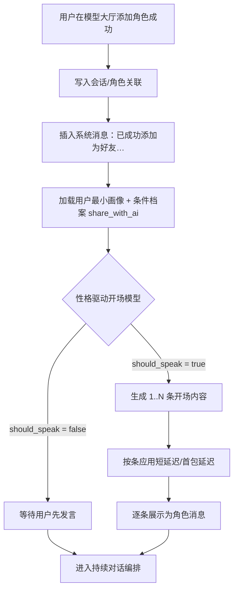
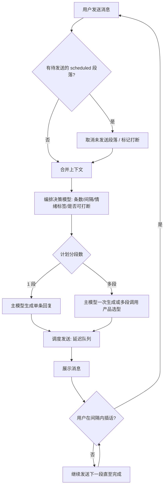
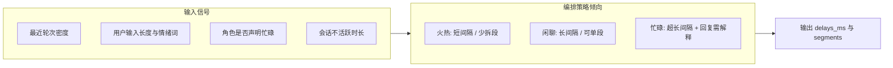

# 普通模式对话设计：好友化开场与拟人节奏编排

> **文档性质**：产品/技术设计草案（待评审与排期）  
> **关联**：`mode=normal` 私聊、模型大厅添加角色、用户档案与 `share_with_ai`（信息分享）  
> **最后更新**：2026-03-28

---

## 1. 背景与目标

普通聊天已按「QQ 式单线私聊」演进。本设计在**不破坏单会话主线**的前提下，补齐三层体验：

1. **关系起点**：从模型大厅添加角色后，有明确的「已成为好友」仪式感，并由**角色性格**决定是否、如何发起首轮对话。  
2. **信息边界**：角色侧始终掌握**称呼所需的最小用户画像**（称呼名、性别）；仅在用户开启**信息分享**时，注入扩展档案（与现有 `share_with_ai` / `personal_setting` 等对齐）。  
3. **拟人节奏**：每一次「角色侧输出」不由单条回复一刀切，而是由**编排决策**决定：发几条、间隔多久、是否因用户插话而重算策略；高热快回、闲聊慢回、「在忙」可长间隔并在回复中自洽说明。

---

## 2. 术语与数据前提

| 概念 | 说明 |
|------|------|
| 系统开场白 | 固定或模板化文案，不经过主模型，用于建立「好友关系已建立」的事实。 |
| 性格驱动开场 | 主模型（或轻量模型）根据角色设定中的性格维度，决定是否追加首轮对话及条数。 |
| 编排决策模型 | 独立一次推理（可与主模型同权或更小模型），输出结构化「下一段发言计划」：条数、间隔、是否等待用户、理由摘要。 |
| 信息分享 | 与用户设置中的 `share_with_ai` 一致；开启时角色可获知档案扩展字段；关闭时仅保留安全默认（如称呼、性别）。 |

后端已有用户上下文字段拼装入口（如 `request_context.build_user_context` 与 Settings 中的 `share_with_ai` 等），实现阶段应**复用同一套字段与合规边界**，避免与 Web/Android 设置分叉。

---

## 3. 用户旅程（从添加到开聊）

### 3.1 触发时机

用户在**模型大厅**将某角色「添加到自己的列表」并成功创建本地/服务端会话时，触发本流程（具体钩子：创建 `conversation` 成功或首次打开该角色聊天页，二者取先发生者，产品可二选一固化）。

### 3.2 系统消息（非模型）

立即插入一条**系统侧或助手侧固定模板**消息（实现上可标记 `source=system` 或等价元数据），示例文案：

> 我们已成功添加为好友，现在可以开始聊天啦~

该条目的目的仅为**状态告知**，不参与性格推理，保证全站一致、可本地化与合规审计。

### 3.3 性格驱动的「是否首发」

在系统消息之后，进入**可选的**「角色主动发言」阶段：

- **输入**：角色设定（含性格/外向度标签或可从设定中抽取的隐含特征）、当前用户可见信息（见第 4 节）。  
- **输出**（结构化，建议 JSON）：  
  - `should_speak`: bool  
  - `message_count`: 0～N（上限产品配置，如 3）  
  - `messages`: 字符串数组（条数与 `message_count` 一致）  
  - `rationale`: 短说明（仅日志/调试，可选展示给高级用户）

**行为约定（示例，可在评审时改为配置表）**：

- **偏内向 / 慢热**：`should_speak=false` 或仅发 0～1 条极短寒暄。  
- **偏外向 / 热情**：可发 1～3 条，拆成连续短气泡，模拟真人的「连发」感。  
- **中性**：随机或按设定表加权，避免千人一面。

### 3.4 与现有「首包延迟」的关系

若已实现普通模式可变回复延迟（`PONYCHAT_IM_REPLY_DELAY_*`），性格驱动首条应**叠加或复用**同一套延迟管线：外向连发时，条与条之间仍应有短间隔（如 0.5～3s 可配置），避免瞬间刷屏。

---

## 4. 角色可见用户信息

### 4.1 始终可用（最小集合）

- **称呼**：优先用户昵称；无昵称时用用户名。  
- **性别**：用于称谓与叙事一致性（与现有用户模型字段对齐）。

### 4.2 条件可用（信息分享开启时）

当 `share_with_ai === true`（或后端等价字段）时，将下列内容纳入**角色侧上下文**（具体字段以 Settings/User 表为准）：

- 个人简介、自定义设定文案、物种/生日等已在产品内开放的字段。  

当 **关闭信息分享** 时：

- 不得将上述扩展字段注入角色提示；决策模型与主模型均不得「推测」未授权信息。

### 4.3 合规与提示词

在系统提示中明确：**「仅使用上下文内显式给出的用户信息；未给出则不得编造。」**

---

## 5. 持续对话：编排决策 + 主生成

### 5.1 每次「角色侧回合」前的决策

在用户发送消息并进入「角色需回复」的回合时，在调用主模型生成正文前（或并行），由**编排决策模型**输出计划：

| 字段 | 含义 |
|------|------|
| `segments` | 本回合拆成的气泡列表（1～M 条，M 上限配置） |
| `delays_ms` | 每条发送前相对上一条的等待（首条相对「用户最后一条」或「本回合开始」） |
| `interruptible` | 若用户在等待期间发话，是否取消剩余 scheduled 段并重算 |
| `mood_tag` | 如 `hot` / `casual` / `busy` / `away`（供日志与 UI 可选展示） |
| `busy_reason_hint` | 当长间隔时，是否要求在正文中解释「刚才在忙什么」（软约束） |

### 5.2 节奏策略（产品规则 + 模型自由组合）

- **聊得火热**（高轮次、短间隔、用户连续输入）：`delays_ms` 整体偏短，分段可少、气泡可短。  
- **偶尔闲聊**：单段或少量段，**间隔可至 1～数分钟**（需任务队列/定时器，见第 6 节）。  
- **角色自述在忙 / 剧情需要离开**：允许 **~30 分钟** 级别间隔；真正发送时由主模型生成带解释的回复（如「刚开完会…」），与 `busy_reason_hint` 对齐。

### 5.3 用户插话

若用户在**已调度但未发送完**的段落之间发送新消息：

1. 取消未发送的 scheduled 段落（或可配置保留部分）。  
2. 将新用户消息作为最高优先级输入。  
3. **重新跑编排决策**，再跑主生成。  

保证「随时可打断、策略不僵死」。

---

## 6. 实现要点（概要）

| 模块 | 说明 |
|------|------|
| 任务调度 | 服务端或客户端需维护「待发送段落 + 延迟」队列；移动端注意进程被杀与重连恢复。 |
| 幂等与取消 | 每次用户新消息携带单调递增 `client_turn_id` 或时间戳，用于作废旧调度。 |
| 决策与主模型分离 | 决策输出结构化 JSON，主模型只负责润色与剧情；避免决策模型写长文。 |
| 观测与调参 | 记录 `mood_tag`、实际间隔、用户打断率，便于后期调权重与上限。 |

---

## 7. 流程图

### 7.1 从模型大厅添加到首次角色发言

### 7.2 单次用户消息后的编排与生成

### 7.3 节奏策略（逻辑视图）

---

## 8. 非目标与风险（本期可不做或慎做）

- **非目标**：把 Galgame/锁分模式的分数与选项迁入普通模式。  
- **风险**：长间隔依赖后台任务，需明确离线策略（合并为一条「回来再说」或尊重原调度）。  
- **风险**：多模型调用成本上升，需默认小模型做决策或缓存策略模板。

---

## 9. 待决问题

1. 「系统开场白」在 UI 上是否显示为**系统灰条**，还是**角色气泡**（产品品牌取舍）。  
2. 编排决策与主模型是否**同一次请求**完成（省延迟）或**强制两次**（省串扰）。  
3. 长间隔（分钟级）是否仅在**服务端调度**可靠，客户端只做展示。

---

*本文档描述的是目标体验与架构方向；落地时需与 `ROADMAP.md` 排期、接口版本及计费策略一并评审。*
